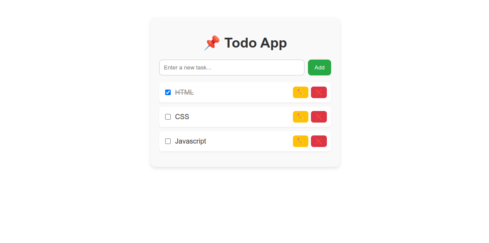

# ✅ Todo List App  

A simple and interactive **Todo List application** built with **React**.  
This app lets you add, edit, delete, and mark tasks as completed, with data saved in **localStorage** so your tasks stay even after refreshing the page.  

---

## 🚀 Features  
- ➕ Add new tasks  
- 📝 Edit tasks  
- ❌ Delete tasks  
- ✅ Mark tasks as completed (strike-through effect)  
- 💾 Persistent storage with localStorage  
- 🎨 Simple and clean UI with responsive design  

---

## 🛠️ Tech Stack  
- React (Frontend framework)  
- JavaScript (ES6+)  
- CSS / Inline styles  
- LocalStorage (for persistence)  

---

## 📦 Installation & Setup  

1. Clone the repository:
   ```bash
   git clone https://github.com/NagamaniMannempalli/Todo-App.git
   ```
2. Navigate into the folder:
   ```bash
   cd Todo-App
   ```
3. Install dependencies:
   ```bash
   npm install
   ```
4. Start development server:
   ```bash
   npm start
   ```
   App will run at 👉 `http://localhost:3000`  

---

## 🏗️ Build for Production  
To create an optimized production build:
```bash
npm run build
```

---

## 🌍 Deployment  
You can deploy the app easily using:
- Vercel → [https://vercel.com](https://vercel.com)  
- Netlify → [https://netlify.com](https://netlify.com)  
- GitHub Pages → [https://pages.github.com](https://pages.github.com)  

---

## 📸 Preview  



---

 